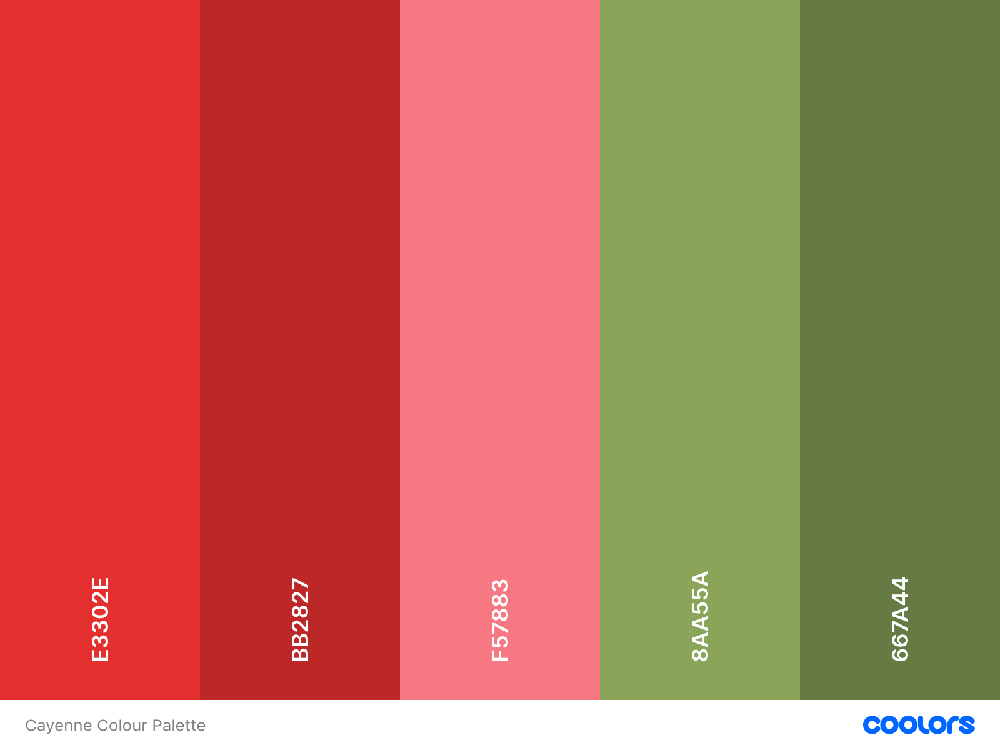
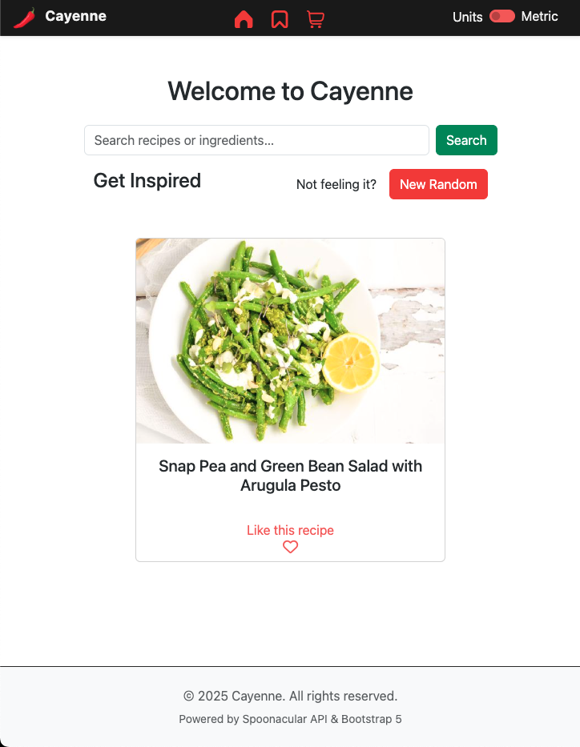
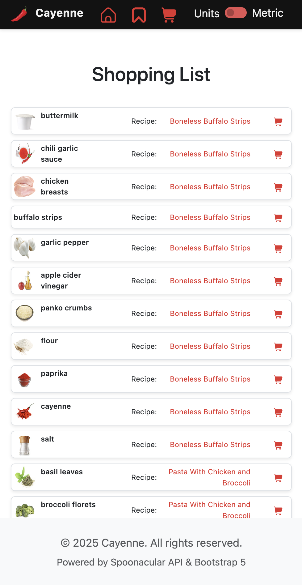
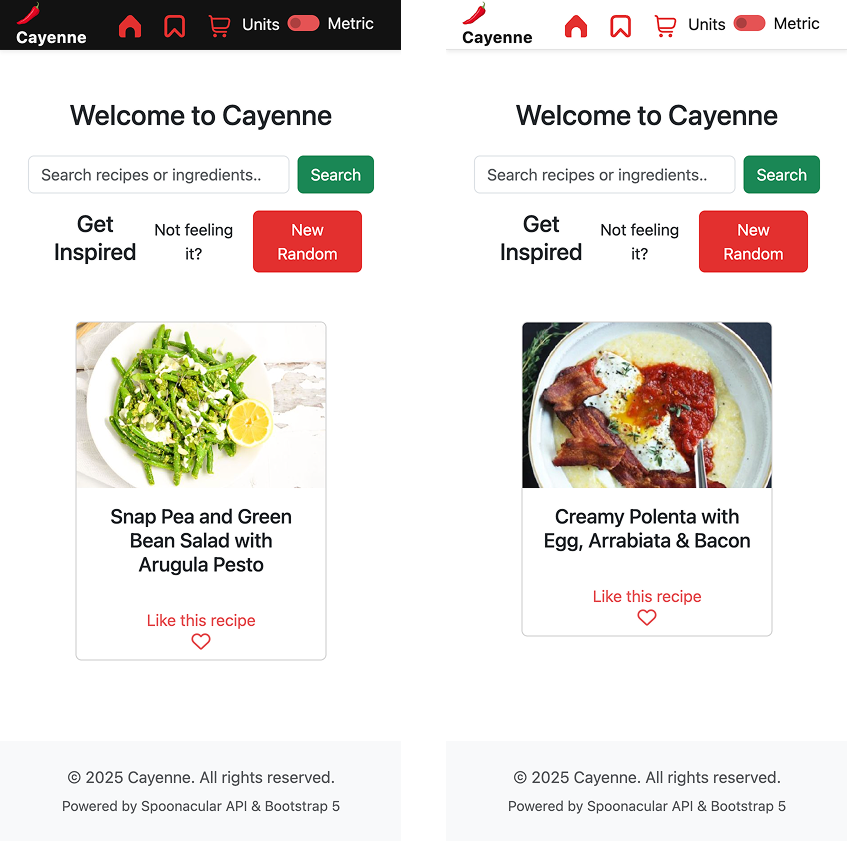
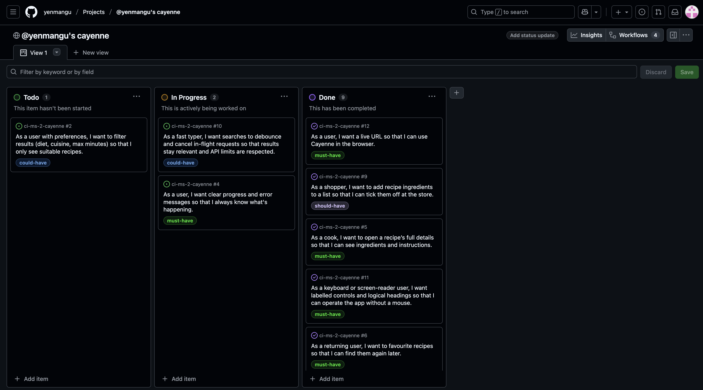

# Cayenne — Recipe Finder

## Overview

## Glossary

| Term             | Definition                                                                           |
| ---------------- | ------------------------------------------------------------------------------------ |
| **API**          | Application Programming Interface — used here to fetch recipe data from Spoonacular. |
| **GET**          | Not used in this context — placeholder if needed for request types or future terms.  |
| **Bootstrap**    | CSS framework used to style layout, forms, and components responsively.              |
| **LocalStorage** | Browser-based storage used to persist favourites and shopping list data.             |

---

## UX

### The 5 Planes of UX

#### 1. Strategy Plane

> This section sets out Cayenne’s core purpose, audience, and user goals. All product decisions are based on addressing real-world needs, ensuring the app delivers practical value to its intended users.

**Purpose**
Cayenne is a recipe discovery and meal-planning app for home cooks and food lovers. It is designed to help users find new recipes based on the ingredients they have, dietary needs, or cuisine preferences. Users can easily save favourites, create and manage shopping lists, and switch between metric and US units—all in a mobile-first, accessible interface.

**Business/User Goals**

- Enable users to quickly find and cook recipes using what they have at home.
- Make it simple to plan meals and manage shopping lists without needing to create an account.
- Showcase professional-grade UI/UX and technical skills, suitable for real-world deployment and portfolio use.

**Primary User Needs**

- Discover recipes based on available ingredients, preferences, or cuisine.
- Save favourite recipes for easy access and meal planning.
- Add ingredients or entire recipes to a shopping list for grocery planning.
- Switch units (metric/US) to suit the user's kitchen and region.
- Enjoy a smooth, responsive, and accessible experience on all devices.

#### 2. Scope Plane

> Here, Cayenne’s functional scope and content requirements are defined. Features are prioritised using MoSCoW methodology, ensuring the project delivers essential value first while clearly outlining future enhancements.

**Features**

- Ingredient-based and complex recipe search via the Spoonacular API
- Detailed recipe pages with ingredients, instructions, and images
- Favourites system (persisted in browser; no login needed)
- Shopping list management (add/remove/check items; clear all)
- Unit toggles (US/metric, long/short)
- Fully responsive design for mobile, tablet, and desktop
- Accessible navigation and ARIA-labelled interactive elements
- “Get Inspired” random recipe feature on landing page, with “New Random” button and instant update.

**Future Features (Could-Have)**

- Advanced filters (diet, cuisine, prep time)
- Multi-lingual support
- Shareable/printable shopping lists

**Content Requirements**

- Clear, informative recipe data (titles, steps, images)
- Attractive, properly attributed food photography
- Iconography for navigation and status (Font Awesome/custom SVGs)
- Help/about info for first-time users

#### 3. Structure Plane

> This section explains Cayenne’s information architecture and user flows. Navigation, hierarchy, and page structure are planned to support intuitive, seamless journeys—so users always know where they are and what to do next.

**Information Architecture**

- **Main Navigation:** Home/Search, Favourites, Shopping List, About
- **SPA Routing:** Uses hash-based routes (`#/route`) for fast, seamless navigation

- **Page Hierarchy:**
  - Search: Ingredient input → Recipe grid results → Recipe detail view
  - Favourites: Saved recipes grid/list
  - Shopping List: Interactive, checkable, and editable list view

_User Flow_

1. **Get Inspired:** On the landing page, a random featured recipe is displayed to inspire the user.
2. **Find a recipe:** Enter ingredients → See matching recipes → Tap for details
3. **Save a favourite:** Tap heart icon on recipe → Accessible via Favourites tab
4. **Shopping list:** Add recipe/ingredient → Manage items from dedicated page

---

#### 4. Skeleton Plane

> The Skeleton Plane documents Cayenne’s wireframes and component layouts, demonstrating how core features and workflows are physically arranged on each screen. Mobile-first responsive design ensures all layouts adapt gracefully to any device.

##### Wireframe Suggestions

**Wireframes & Layout**

- **Mobile-first layouts:** All screens are designed for small devices first, then expand for tablet/desktop
- **Core Screens:**
  - Home/Search (ingredient input and recipe grid)
  - Recipe Detail (accordion layout, image, actions)
  - Favourites (card/grid layout)
  - Shopping List (interactive list, add/remove/check)
  - App Header (toggles, icons, site nav)
- **Component-based skeleton:** Each page uses modular, reusable components for cards, toggles, buttons, and lists

## Wireframes

| Page          | Mobile                                                                                       | Tablet                                                                                       | Desktop                                                                                        |
| ------------- | -------------------------------------------------------------------------------------------- | -------------------------------------------------------------------------------------------- | ---------------------------------------------------------------------------------------------- |
| Home / Index  |               |               |               |
| App Landing   |                 |                 |                 |
| Recipe Grid   |    |    |    |
| Recipe Detail |  |  |  |
| Shopping List |  |  |  |
| Features      |            |            |            |

> **Wireframes were created in [Figma/Mockflow/etc.] and closely followed throughout the build. Design changes made during development are documented in the README.**

#### 5. Surface Plane

> This section explains Cayenne’s visual design system, including colour palette, typography, imagery, interactivity, and support for modern features like dark mode. Each element is selected and tested for clarity, accessibility, and brand consistency.

##### Visual Design Elements

- **[Colours](#colour-scheme)**: see below
- **[Typography](#typography)**: see below
- **[Imagery](#imagery)**: see below
- **[Interactivity](#interactivity)**: see below

- **Dark Mode Support:**
  - Cayenne respects users’ system dark mode preferences.
  - When the browser is set to dark mode (`prefers-color-scheme: dark`), a dark colour palette is automatically applied for reduced eye strain and better accessibility in low-light environments.
  - Colours and backgrounds are blended using CSS custom properties and `color-mix` for smooth transitions between themes.

### Colour Scheme

I used [the favicon](./assets/images/favicon/apple-touch-icon.png) along with a colour picker tool to choose the Cayenne colour palette.

> Primary reds and greens, inspired by the Cayenne logo and favicon, contrast-checked for accessibility

| Tone            | Hex       | HSL                  | Use                                                    |
| --------------- | --------- | -------------------- | ------------------------------------------------------ |
| **Main Red**    | `#e3302e` | `hsl(1, 77%, 53%)`   | Primary brand accent (buttons, highlights)             |
| **Dark Red**    | `#bb2827` | `hsl(1, 63%, 44%)`   | Active / pressed / hover states, strong emphasis       |
| **Light Red**   | `#f57883` | `hsl(355, 85%, 72%)` | Subtle accents, link hovers, backgrounds               |
| **Light Green** | `#8aa55a` | `hsl(82, 30%, 50%)`  | Secondary accent, success / confirmation               |
| **Dark Green**  | `#667a44` | `hsl(82, 28%, 37%)`  | Darker success states, contrast text on green surfaces |

I used [Coolors](https://coolors.co/e3302e-bb2827-f57883-8aa55a-667a44) to generate the following pallete from my chosen colours.


### Typography

- Legible, modern sans-serif fonts (Montserrat, etc.)
- Font Awesome and custom SVG icons for clarity and recognisability

### Imagery

- High-quality, attribution-checked food photography, all with descriptive alt text

  > see [Credits](#foodstock-images--icons) for specific attribution.

### Interactivity & Feedback

- Buttons/links have visible hover/active states and ARIA labels
- “Liked”/“favourited” status is animated for positive feedback
- Error states and loading are clearly communicated to users

**Accessibility Commitment**

- Colour contrast meets or exceeds WCAG 2.1 AA where possible
- All navigation and controls are fully keyboard-accessible
- ARIA labels, roles, and focus indicators are included for all interactive elements

## User Stories

| Target                      | Expectation                                               | Outcome                                                    |
| --------------------------- | --------------------------------------------------------- | ---------------------------------------------------------- |
| Home cook                   | I want to search for recipes by keywords                  | so that I can quickly find relevant dishes                 |
| User with preferences       | I want to filter results (diet, cuisine, max minutes)     | so that I only see suitable recipes                        |
| User with items at home     | I want to include ingredients in my search                | so that I can reduce food waste                            |
| User                        | I want clear progress and error messages                  | so that I always know what's happening                     |
| Cook                        | I want to open a recipe’s full details                    | so that I can see ingredients and instructions             |
| Returning user              | I want to favourite recipes                               | so that I can find them again later                        |
| Mobile user                 | I want a touch-friendly layout                            | so that I can use the app on any device                    |
| User                        | I want invalid URLs to send me back safely                | so that I never break the app                              |
| Shopper                     | I want to add recipe ingredients to a list                | so that I can tick them off at the store                   |
| Fast typer                  | I want searches to debounce and cancel in-flight requests | so that results stay relevant and API limits are respected |
| Keyboard/screen reader user | I want labelled controls and logical headings             | so that I can operate the app without a mouse              |
| User                        | I want a live URL                                         | so that I can use Cayenne in the browser                   |

## Features

### **MoSCoW** Prioritisation

Using the **Must-Have**, **Should-Have**, **Could-Have** and **Won't-Have** prioritisation method, the user stories are prioritised in order to better manage the time and resources of the project effectively.

I've decomposed my Epics into User Stories for prioritizing and implementing them. Using this approach, I was able to apply "MoSCow" prioritization and labels to my User Stories within the Issues tab.

- **Must Have**: guaranteed to be delivered - required to Pass the project (_max ~60% of stories_)
- **Should Have**: adds significant value, but not vital (_~20% of stories_)
- **Could Have**: has small impact if left out (_the rest ~20% of stories_)
- **Won't Have**: not a priority for this iteration - future features

### Existing Features

> Features documented here are divided into two sections: [User Facing Features](#user-facing-features) and [Development Features](#development-features) to ensure a clear distinction between what benefits the end user, and what supports the development process.
>
> **User Facing Features** cover all aspects of the app that the user interacts with or experiences directly.
> **Development Features** highlight the tools, systems, or processes implemented to improve workflow, maintainability, or code quality behind the scenes.

#### User Facing Features

| Feature                              | Notes/Benefits                                                                                                | More Info / Screenshot                                                      |
| ------------------------------------ | ------------------------------------------------------------------------------------------------------------- | --------------------------------------------------------------------------- |
| **Ingredient-Based Recipe Search**   | Users can discover recipes by entering the ingredients they have, reducing waste and increasing convenience.  | [Home/Search](#home)                                                        |
| **Random Recipe Inspiration**        | The landing page displays a random featured recipe; users can click "New Random" for more ideas instantly.    |           |
| **Detailed Recipe Pages**            | Each recipe has a dedicated page with images, ingredient cards, steps, and nutrition info where available.    | [Recipe Detail](#recipe-detail)                                             |
| **Favourites / Saved Recipes**       | Users can "heart" recipes to save them in their browser for future visits; works across sessions, no login.   | [Favourites Tab](#favourites), [Persistence](#state-management)             |
| **Shopping List Management**         | Easily add ingredients or whole recipes to a shopping list for grocery planning; check off items as you shop. | [Shopping List](#shopping-list)                                             |
| **Unit System Toggle (US/Metric)**   | Instantly switch ingredient units to match user preference; works globally across recipes.                    | [Header Toggle](#unit-toggle), [theme.css](./assets/css/theme.css)          |
| **Mobile-First Responsive Design**   | The app adapts seamlessly to mobile, tablet, and desktop, ensuring usability on any device.                   |  |
| **Accessible Navigation & Controls** | All navigation and actions are keyboard accessible and ARIA labelled for users with assistive technology.     | [Accessibility Commitment](#accessibility)                                  |
| **Animated UI Feedback**             | Visual feedback for actions (e.g., recipe card being removed with animation) for an engaging experience.      |         |
| **Dark Mode Support**                | App automatically adapts to user's system theme (light/dark) for comfort and accessibility.                   |         |

#### Development Features

| Feature                            | Notes/Benefits                                                                                                                     | More Info                                                                         |
| ---------------------------------- | ---------------------------------------------------------------------------------------------------------------------------------- | --------------------------------------------------------------------------------- |
| **Custom State Management**        | Modular, event-driven global store with chainable subscriptions and selective persistence for maintainable, reactive UI.           | [appStore.js](./src/appStore.js) [store.js]('./src/event/store.js)                |
| **Component-Based Architecture**   | Code is organised in vertical slice architecture (controller/view/service) for easy maintenance, scalability, and team onboarding. | [components/](./src/components/) See also [Architecture](#architecture)           |
| **Custom Event Emitter**           | RxJS-inspired pattern enables granular, flexible communication across the app, including chainable tap/once/unsubscribe.           | [eventEmitter.js](./src/event/eventEmitter.js)                                    |
| **SPA Router**                     | Hash-based single-page routing enables fast, seamless navigation and supports memory-safe destroy pattern for components.          | [router/](./src/router/)                                                          |
| **Centralised Error Handling**     | Dedicated error message component ensures consistent, user-friendly error states and easy extension for future features.           | [error-message/](./src/components/error-message/)                                 |
| **Testing Framework (Jest)**       | Automated unit tests for store, state, and utilities; manual/screenshot UI testing ensures reliability and fast regression checks. | [tests/](./src/tests/) [TESTING.md](./TESTING.md)                                 |
| **Dev-Only UI Controls**           | Environment-based controls (e.g., state logging, reset buttons) accelerate debugging and are excluded from production builds.      |                  |
| **Conventional Commits**           | Descriptive, atomic commits improve traceability and help both assessors and collaborators follow the development process.         | [COMMIT_CONVENTIONS.md](./COMMIT_CONVENTIONS.md)                                  |
| **BEM CSS & Code Style**           | CSS follows BEM for modularity and conflict-resistance; file and variable naming is consistent and cross-platform safe.            | [theme.css](./assets/css/theme.css)                                               |
| **Mobile-First Responsive Design** | All wireframes and layouts prioritise mobile experience, with scalable components for tablet/desktop.                              | [theme.css](./assets/css/theme.css), [wireframes](./documentation/ux/wireframes/) |
| **Asset Management & Attribution** | All static assets and icons are clearly organised and credited, supporting both licensing and future asset updates.                | [assets/](./assets/), [README.md](#credits)                                       |
| **Error Handling & User Feedback** | Friendly, branded error messages, loading indicators, and retry options for failed API or network calls.                           |                      |

### Future Features

| Feature                                  | Notes/Benefits                                                                                                                | More Info / Notes                                           |
| ---------------------------------------- | ----------------------------------------------------------------------------------------------------------------------------- | ----------------------------------------------------------- |
| **Add All Ingredients to Shopping List** | Enable users to add every ingredient for a recipe to their shopping list in one click, saving time and reducing missed items. | UI button planned for recipe detail page                    |
| **Advanced Filters in Recipe Results**   | Allow users to filter search results by diet, cuisine, prep time, or allergies, for more personalised meal planning.          | Could use Spoonacular's complexSearch endpoint              |
| **User Accounts & Cloud Sync**           | Let users create accounts to sync favourites and shopping lists across devices, supporting long-term meal planning.           | Would require server-side backend (e.g., Node/Express + DB) |
| **Debounced Search Input**               | Reduce unnecessary API calls and improve performance by debouncing ingredient search inputs.                                  | Improves UX, reduces API quota usage                        |

## Architecture

> Cayenne is architected as a modular, component-driven single page application (SPA), using modern JavaScript (ES modules) and Bootstrap for responsive design. The application’s structure is deliberately organised to maximise maintainability, reusability, and testability—enabling future features and team development.

### High-Level Overview

- **Vertical Slice Architecture:**
  Cayenne follows a _vertical slice_ or _feature slice_ structure, where each major feature (e.g., RecipeCard, ShoppingList) is self-contained in its own folder, including its controller, view, service, CSS, and local typedefs. This pattern ensures feature logic and styling are tightly scoped, reducing coupling and making maintenance straightforward.

- **Component-Based Design:**
  All user-facing elements are built as reusable, self-contained components (e.g., `RecipeCard`, `RecipeGrid`, `IconButton`, `ErrorMessage`). Components communicate via the global event emitter, never directly, promoting loose coupling.

- **SPA Routing:**
  A custom, hash-based router powers seamless in-app navigation and route-based rendering, supporting deep linking (e.g., `#/recipe?id=123`) and efficient memory management through the destroy pattern.

- **State Management:**
  A singleton, event-driven store coordinates global application state. Components subscribe to store events (via Pub/Sub) and reactively update as needed. State is selectively persisted in `localStorage` for favourites and shopping lists.

- **API Abstraction:**
  All API requests are handled through a dedicated service layer, routing via a Node.js/Vercel proxy to protect sensitive keys and simplify error handling.

- **Accessibility & Theming:**
  All layouts and components are designed mobile-first and support both light and dark modes via CSS variables and media queries. Accessibility is prioritised throughout, with ARIA, keyboard nav, and tested contrast ratios.

- _All files use ES module syntax (`import/export`)_ [Javascript](#javascript)
- _CSS uses BEM naming and lives either globally (`theme.css`) or locally with components._ [BEM](#bem-naming-convention)
- _Documentation and screenshots are kept outside the codebase for clarity_

**_Rationale_**

- _Scalability_:
  New features can be developed as isolated vertical slices without risking regression in unrelated areas.
- _Testability_:
  Modular code enables unit and integration testing of components and services.
- _Maintainability_:
  Clearly defined boundaries reduce cognitive overhead for future contributors or maintainers.
- _Performance_:
  SPA architecture and modular routing minimise unnecessary re-renders and support future lazy loading.

## Design Patterns

> Cayenne applies several well-known software design patterns to ensure a modular, maintainable, and testable codebase. Key patterns are summarised below, with examples of how they are used in the application.

### Singleton

The **Singleton** pattern is used to ensure that a class or module has only one instance throughout the application lifecycle.
**Example in Cayenne:**

- The global state store is implemented as a singleton, ensuring there is a single source of truth for app state.
- The Icon Registry (which loads and caches SVG icons) also uses this pattern, so all components share the same cache.

### Publish/Subscribe pattern

The **Publish/Subscribe** (Pub/Sub) pattern enables decoupled communication between different parts of the application.

**Example in Cayenne:**

- The custom event emitter implements the Pub/Sub pattern and is used to broadcast state changes, UI events, and dev tool triggers.
- UI components subscribe to specific events (e.g., `state:change`), ensuring they reactively update without tight coupling to the store.

> See [State Management System](#state-management-system) for more detail on how Pub/Sub powers Cayenne's reactive architecture.

### Registry Pattern

The **Registry** pattern provides a centralised lookup and management mechanism for reusable resources.
**Example in Cayenne:**

- The Icon Registry module stores and retrieves SVG icons by name, allowing components to render icons efficiently without re-fetching or duplicating SVG data.

## State Management System

Cayenne uses a modular, event-driven state management system to coordinate application state and UI updates. This system is designed for flexibility, testability, and future scalability.

### Core Concepts

- **Global Store**: The core application state is managed by a central store implemented in plain JavaScript, using a custom event emitter for reactive updates.
- **Event-Driven Architecture**: All state changes publish events (e.g., `state:change`), which UI components subscribe to. This ensures efficient and decoupled updates throughout the application.
- **Selective Persistence**: Only user-relevant state (such as `likedRecipes` and `unitLocale`) is persisted to `localStorage`. Ephemeral or session-only data remains in-memory and is never stored across reloads.
- **Environment-Safe Dev Tools**: Developer tools and debug controls are injected into the UI only in non-production environments, using a central environment flag (`isProd`). This prevents debug features from leaking into production builds.

### State Management Features

| Feature         | Notes                                                                                                                                                                                                             |
| --------------- | ----------------------------------------------------------------------------------------------------------------------------------------------------------------------------------------------------------------- |
| Reactive UI     | UI components automatically update when relevant state changes occur, via store subscriptions.                                                                                                                    |
| Async-Ready API | State persistence methods (such as reset and save) are wrapped in async functions, allowing for seamless migration to future async storage mechanisms (like IndexedDB or cloud storage) without changing the API. |
| Testability     | The decoupled, event-based approach allows for straightforward unit testing of both state and UI logic.                                                                                                           |
| Extensibility   | The system can be easily extended to support new features, additional persisted fields, or more advanced dev tooling.                                                                                             |

### Example Workflow

1. **User Action**: User toggles a unit setting or likes a recipe.
2. **State Update**: The store updates the relevant state and triggers a `state:change` event.
3. **Persistence**: Only the whitelisted fields are saved to `localStorage`.
4. **UI Reaction**: Subscribed components detect the state change and re-render as needed.

### Technical Notes

- The store and event system are implemented in vanilla JavaScript (no frameworks), and fully documented with JSDoc for editor IntelliSense.
- Dev-only features (such as state logging and reset buttons) are never included in production builds.

## SPA Navigation

> **Note:**
> The SPA navigation system originally used `window.location.pathname` and a helper function `getActivePageLink()` to resolve active links, suitable for multi-page sites or static hosting with `.html` files.
>
> **This has now been replaced** with a modern, hash-based SPA router, which allows for truly single-page navigation and dynamic, client-side route resolution.
> This change improved routing reliability, deep-linking, and browser history support—especially on GitHub Pages and in local development.

<details>
<summary>Earlier approach (now deprecated)</summary>

### Active Link Resolution - Deprecated

~~The function `getActivePageLink()` (defined in [`src/navigation.js`](./src/navigation.js)) is responsible for determining which navigation link should be marked as active, based on the current `window.location.pathname`.~~

~~It uses a robust matching strategy:~~
~~- Normalises `/` and `''` to `/index.html` to support local development (Live Server) and GitHub Pages~~
~~- Matches each link using `pathname.endsWith(linkPath)`, where `linkPath` is the trailing segment of the link's href (e.g. `/features.html`)~~

~~This ensures correct behaviour when the site is served from:~~

~~- A root `/` path locally~~
~~- A `.html` filename (e.g. `/features.html`)~~
~~- GitHub Pages (`/cayenne/features.html`)~~

~~The link config is defined in `navbarConfig.js`, and used by `initNavbar()` to render the active `<nav>` state.~~

</details>

### Current Approach

Cayenne now uses a custom, hash-based SPA router (see [`src/router/`](./src/router/)), which:

- Parses the `window.location.hash` and updates the UI accordingly, supporting routes like `#/recipe?id=123`.
- Maintains an internal route map for efficient, dynamic page/component rendering.
- Properly destroys old components on route change to prevent memory leaks or “zombie” UI.
- Supports deep-linking, browser navigation (back/forward), and is compatible with GitHub Pages’ static hosting.

This SPA routing system ensures a seamless, app-like experience for users on both desktop and mobile, without requiring any backend server configuration.

## Spoonacular API Integration

> Cayenne integrates with the [Spoonacular Food API](https://spoonacular.com/food-api) to provide live, up-to-date recipe search, ingredient data, and nutritional information. All API access is securely handled via a custom proxy server to protect sensitive keys and standardise communication.

### Architecture Overview

- **API Proxy Layer:**
  All API requests are routed through a custom Node.js proxy (deployed on Vercel) to:

  - **Hide the Spoonacular API key** (never exposed in frontend code or network requests).
  - **Enforce CORS policy** for allowed origins.
  - **Simplify request formatting** and future-proof against API changes.
  - **Optionally serve mock/test data** during development, protecting live API quotas.

- **Frontend Integration:**
  - The frontend uses a dedicated service module (e.g., `spoonacularClient.js`) to build and send API requests to the proxy.
  - All data fetching (search, recipe detail, ingredient lookups) is done asynchronously, with error handling and loading states displayed to the user.
  - Only safe, relevant recipe and ingredient data is passed to UI components—never raw or extraneous API fields.

### Security & Best Practice

- No API keys or sensitive data are ever stored or visible in the client-side codebase.
- All requests are “read-only” (no mutation, no user accounts), minimising security risk and attack surface.
- Error handling is robust: users see helpful messages if the API or network fails, with retry options where possible.

### Test & Development Support

- The proxy supports a **test data endpoint** (`/api/test?test=true`) that returns sample recipes in the same format as the live API.
- This allows development and UI testing **without consuming live API quota** or risking inconsistent real-world data.
- Switching between test and live data is easily controlled via a config flag.

### Example Request Flow

1. **User Action:** User searches for recipes with “chicken” and “rice”.
2. **Frontend:** Sends a GET request to `/api/recipes/complexSearch?ingredients=chicken,rice&number=20` (via the proxy).
3. **Proxy:** Adds the Spoonacular API key, forwards the request, and returns a filtered response.
4. **Frontend:** Receives the results and renders the recipe grid.

### Source Code

- **Proxy server:** [`ci-cayenne-proxy`](https://github.com/yenmangu/ci-cayenne-proxy)
- **Frontend integration:** [`spoonacularClient.js`](./src/services/spoonacularClient.js)

> For more details on endpoint parameters and implementation progress, see [COMPLEX_SEARCH.md](./COMPLEX_SEARCH.md).

## Development & Code Style

> Cayenne is developed with a focus on maintainability, clarity, and modern best practices. Code is written to be self-documenting, with strong adherence to community conventions for version control, structure, and naming.

### GIT

We follow the [Conventional Commits](COMMIT_CONVENTIONS.md) specification.
This ensures all commits are consistent, scoped, and easy to scan.

> Note: Conventional Commits were adopted from 10 September 2025. Earlier commit messages may not follow this format.

### JavaScript

All JavaScript in Cayenne uses modern [ES Module syntax](https://developer.mozilla.org/en-US/docs/Web/JavaScript/Guide/Modules) (`import`/`export`) for modularity and maintainability.

- **Style conventions:**
  - Lower camelCase for variables, functions, and files (no spaces or capitals for cross-platform safety).
  - Functions and classes are documented with [JSDoc](https://jsdoc.app/) for strong IntelliSense and code navigation in VS Code.
  - All major architectural patterns (store, emitter, service) are fully typed and documented.
  - No build tools or transpilers are used; the codebase targets modern browsers (see [Browser Compatibility](#browser-compatibility)).
- **Separation of concerns:**
  - Logic, view rendering, and services are kept in separate modules for each component or slice.

### HTML

- All HTML is written in semantic, accessible markup.
- Components are structured using appropriate tags (`<main>`, `<nav>`, `<header>`, `<section>`, `<article>`, etc.).
- ARIA roles and labels are included where necessary for screen readers and assistive tech.
- No inline styles or scripts; all behaviour and styling is in linked external files.

> **Exception:**
> For technical reasons, certain parts of the app (such as the responsive header system) programmatically apply inline styles directly to `document.documentElement` (the `<html>` tag) at runtime.
> This is necessary for responsive scroll animation and to ensure CSS variables are synchronised across viewport and header changes—techniques which cannot be fully achieved via static CSS alone.
> All such inline styles are set and managed via dedicated JavaScript modules (e.g., `responsiveHeader.js`), and are removed or updated as needed to avoid style conflicts or memory leaks.

> [!NOTE]
> Any inline styles added programmatically are reset and restored on page changes to ensure a consistent and maintainable DOM. This prevents style accumulation or memory leaks and preserves cross-page visual integrity.

### CSS

All custom CSS adopts the BEM (Block, Element, Modifier) naming convention for modular, maintainable styles.

**Benefits:**

- Styles are easy to read and understand
- Modular and reusable across different pages or components
- Resistant to conflicts caused by global class names

#### BEM Naming Convention

**BEM** stands for:

- **Block** – The standalone component (`recipe-card`)
- **Element** – A child part of that component (`recipe-card__title`)
- **Modifier** – A variation of the block or element (`recipe-card--featured`)

```
.block {}
.block__element {}
.block--modifier {}
```

#### Example

```html
<article class="recipe-card recipe-card--featured">
	
	<h2 class="recipe-card__title">Spaghetti Bolognese</h2>
	<p class="recipe-card__description">A classic Italian dish...</p>
</article>
```

```css
.recipe-card {
	background: white;
	border-radius: 0.5rem;
}

.recipe-card--featured {
	border: 2px solid var(--accent);
}

.recipe-card__title {
	font-size: 1.25rem;
	font-weight: bold;
}
```

## Tools and Technologies

| Tool / Tech                                                                                                             | Use                                                                         |
| ----------------------------------------------------------------------------------------------------------------------- | --------------------------------------------------------------------------- |
| [](https://markdown.2bn.dev) | Generate README and TESTING templates.                                      |
| [](https://git-scm.com)                        | Version control. (`git add`, `git commit`, `git push`)                      |
| [](https://github.com)                   | Secure online code storage.                                                 |
| [](https://code.visualstudio.com)          | Local IDE for development.                                                  |
| [](https://en.wikipedia.org/wiki/HTML)      | Main site content and layout.                                               |
| [](https://en.wikipedia.org/wiki/CSS)         | Design and layout.                                                          |
|                           | Interactive components and all `./src/` code.                               |
| [](https://pages.github.com)  | Hosting the deployed front-end site.                                        |
| [](https://getbootstrap.com)       | Front-end CSS framework for modern responsiveness and pre-built components. |
| [](https://www.figma.com)                  | Creating wireframes.                                                        |
| [](https://fontawesome.com)   | Icons.                                                                      |

## Agile Development Process

> Cayenne was developed using Agile methodologies, leveraging GitHub’s project management tools for iterative planning, task tracking, and prioritisation. This ensured the project remained user-focused, adaptable, and transparent throughout its lifecycle.

### GitHub Projects

[GitHub Projects](https://github.com/users/yenmangu/projects/9) served as an Agile tool for this project. Through it, User Stories, issues/bugs, and Milestone tasks were planned, then subsequently tracked on a regular basis using the Kanban project board.



### GitHub Pages

The site was deployed to GitHub Pages. The steps to deploy are as follows:

- In the [GitHub repository](https://github.com/yenmangu/ci-ms-2-cayenne), navigate to the "Settings" tab.
- In Settings, click on the "Pages" link from the menu on the left.
- From the "Build and deployment" section, click the drop-down called "Branch", and select the **main** branch, then click "Save".
- The page will be automatically refreshed with a detailed message display to indicate the successful deployment.
- Allow up to 5 minutes for the site to fully deploy.

The live link can be found on [GitHub Pages](https://yenmangu.github.io/ci-ms-2-cayenne/).

### GitHub Issues

GitHub Issues were used to document, discuss, and resolve individual tasks, bugs, and feature ideas.

- **User Stories:** Each key feature began as a user story, often linked to the MoSCoW prioritisation process below.
- **Bugs/Tasks:** Each bug or technical task received its own issue, linked to the appropriate project board column for tracking and resolution.
- **Transparency:** Issue numbers and references appear in commit messages for traceability and auditability.

### MoSCoW Prioritisation

MoSCoW (Must, Should, Could, Won’t Have) was used throughout the project to prioritise user stories and features.
For a full explanation and breakdown, see [MoSCoW Prioritisation](#moscow-prioritisation) under User Stories and Features.

> [!NOTE]
> See [Complex Search](COMPLEX_SEARCH.md) for MoSCoW prioritisation of the full [complexSearch](https://spoonacular.com/food-api/docs#Search-Recipes-Complex) endpoint

## Development Bugs

| Bug/Issue                                                                                                    | Diagnosis                                                                                                                                                                                                                                                                         | Fix                                                                                                                                                                                                                                                                                                                                | Commit Ref                                                                                             |
| ------------------------------------------------------------------------------------------------------------ | --------------------------------------------------------------------------------------------------------------------------------------------------------------------------------------------------------------------------------------------------------------------------------- | ---------------------------------------------------------------------------------------------------------------------------------------------------------------------------------------------------------------------------------------------------------------------------------------------------------------------------------- | ------------------------------------------------------------------------------------------------------ |
| Recipe card like button causes routing to fail or not-found after click; unexpected re-renders or UI flicker | Root cause: When liking a recipe, the anchor `href` was set to `#recipe?id=...` (missing the canonical slash). This broke SPA hash parsing (`#/recipe?id=...` expected). A secondary symptom was over-broad state updates (publishing the entire state), causing UI flicker.      | 1. **Routing:** Ensure all dynamic anchor `href` values use the canonical `#/route` format.<br>2. **State:** Update state management to publish only the `likedRecipes` slice when liking/unliking, and have `RecipeCard` subscribe only to `state:likedRecipes`. This prevents unnecessary re-renders and keeps UI logic modular. | [2dda52b](https://github.com/yenmangu/ci-ms-2-cayenne/commit/2dda52b07fa17a0d5ea52b207bf1b699b2aba929) |
| Zombie component reacts after navigation (memory leak, error)                                                | After navigating away, old component instance remained subscribed to state, causing `TypeError` on future state changes (e.g., when a new recipe was fetched). Root cause: router did not call `.destroy()` on previous instance during navigation, leaving event listeners live. | Refactored router to destroy the previous component instance before rendering the new one on route change. All route handlers now return their instance or `null`. See [Zombie Component Bug](./documentation/bugs/zombie-component-bug.md)                                                                                        | [d275764](https://github.com/yenmangu/ci-ms-2-cayenne/commit/d275764)                                  |

## Testing

> [!NOTE]
> For all testing please refer to the [TESTING.md](TESTING.md) file.

## Deployment

### API Proxy

The Cayenne app uses a lightweight Node.js API proxy (deployed on Vercel) to safely access the Spoonacular API.
This proxy is used to:

- Keep all API keys secure and out of the public frontend
- Apply minimal validation and request shaping
- Simplify and standardise communication with Spoonacular

All client-side requests from the Cayenne frontend go through this proxy (no direct calls to Spoonacular).

See also: [ci-cayenne-proxy](https://github.com/yenmangu/ci-cayenne-proxy) for the full backend proxy source code.

#### Test Recipe API Route

To support rapid development and testing without using up the live Spoonacular API quota, the backend proxy includes a dedicated test route:

- **Endpoint:** `/api/test?test=true`
- **Returns:** A set of stored recipe data in exactly the same format as the live Spoonacular API response.

This allows the Cayenne frontend to develop and test all recipe features using realistic, predictable data—without requiring live API access or risking quota exhaustion.
The frontend can be easily switched to use either the live API or the test route as needed.

**Note:**
All test data is kept in sync with the expected live API format for seamless integration and code parity.

### Security: Why No JWT/Auth?

The Cayenne API proxy **does not implement JWT or other authentication methods**.
This is an intentional design decision based on the following:

- **No user accounts or sensitive data:**
  The API never handles personal data, logins, or user-specific information.
  All requests are read-only (fetching recipes, ingredients, etc.).

- **Purpose is solely to protect the Spoonacular API key:**
  The only reason for the proxy is to avoid exposing the secret key in client-side code.

- **Minimal attack surface:**
  There are no endpoints that mutate state, manage sessions, or store user data.

- **Simplicity and performance:**
  Removing JWT/auth logic reduces complexity, avoids extra network overhead, and ensures smooth user experience.

If the project ever evolves to handle user logins, saved favourites, or custom data,
robust authentication (such as JWT) would be implemented as a future phase.

### GitHub Pages

### Local Development

> [!IMPORTANT]
> While all of the code is open source, the Node.js API proxy enforces CORS with an allowed origin list for security.
>
> - If you wish to use the official Node.js proxy, please contact the author to request your origin be added.
> - Alternatively, you are welcome to fork this repo and deploy your own proxy.
> - To connect directly to Spoonacular, you’ll need your own (free) API key:
>   [Spoonacular API Portal](https://spoonacular.com/food-api/)

**Note:**
By default, the Cayenne front-end app expects the proxy to be available at the configured API base URL.
You can override this in your environment if running your own version.

#### Cloning

#### Forking

### Local VS Deployment

## Browser Compatibility

Cayenne is written in modern JavaScript (ES modules) without build tools or transpilation.
Browser support details and feature compatibility are documented in [DEVELOPMENT.md](./DEVELOPMENT.md#browser-compatibility).

## Credits

### Credits For Specific Features

| Feature      | Source                                                                                                                              | Notes                                                                                                                                                        |
| ------------ | ----------------------------------------------------------------------------------------------------------------------------------- | ------------------------------------------------------------------------------------------------------------------------------------------------------------ |
| Hash routing | [Medium - Hash routing](https://thedevdrawer.medium.com/single-page-application-routing-using-hash-or-url-d6d1e2adcde/Hash_routing) | Inspiration for using `hashchange` because GitHub pages does not support History API [GitHub Community](https://github.com/orgs/community/discussions/64096) |

### Other Credits

| Material                                 | Source                                                   |
| ---------------------------------------- | -------------------------------------------------------- |
| CSS - Block, Element, Modifider Strategy | [BEM-101 on CSS-Tricks](https://css-tricks.com/bem-101/) |
|                                          |                                                          |

### Content

### Media

#### Food/Stock Images & Icons

| Media                                               | Attribution                                                                                                                                         |
| --------------------------------------------------- | --------------------------------------------------------------------------------------------------------------------------------------------------- |
|           | Photo by Isaiah : https://www.pexels.com/photo/white-and-gray-chevron-print-recipes-book-833109/                                                    |
|      | Photo by Dapur Melodi: https://www.pexels.com/photo/person-pouring-salt-in-bowl-1109197/                                                            |
|  | Photo by Daniela Elena Tentis: https://www.pexels.com/photo/black-frying-pan-with-spaghetti-sauce-near-brown-wooden-ladle-and-ripe-tomatoes-691114/ |
|      | Photo by Juan Pablo Serrano : https://www.pexels.com/photo/woman-eating-on-cooking-pan-1587830/                                                     |
|       | Photo by Pixabay: https://www.pexels.com/photo/spices-on-bowl-near-knife-on-chopping-boad-33242/                                                    |

### Acknowledgements

- I would like to thank my Code Institute mentor, [Tim Nelson](https://www.github.com/TravelTimN) for the support throughout the development of this project.
- I would like to thank the [Code Institute](https://codeinstitute.net) Tutor Team for their assistance with troubleshooting and debugging some project issues.
- I would like to thank the [Code Institute Slack community](https://code-institute-room.slack.com) for the moral support; it kept me going during periods of self doubt and impostor syndrome.
- I would like to thank my employer, for supporting me in my career development change towards becoming a software developer.
