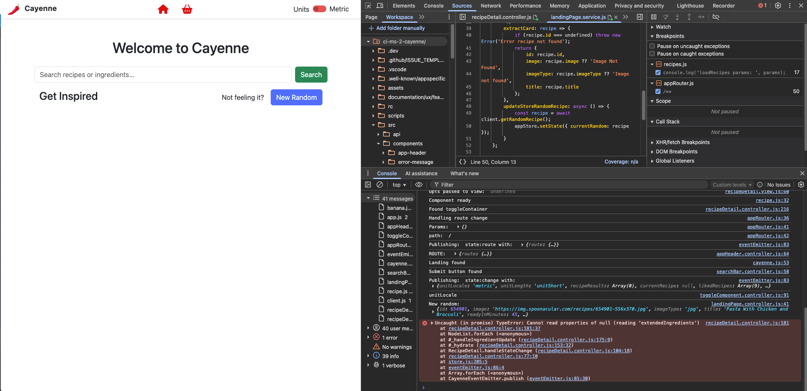
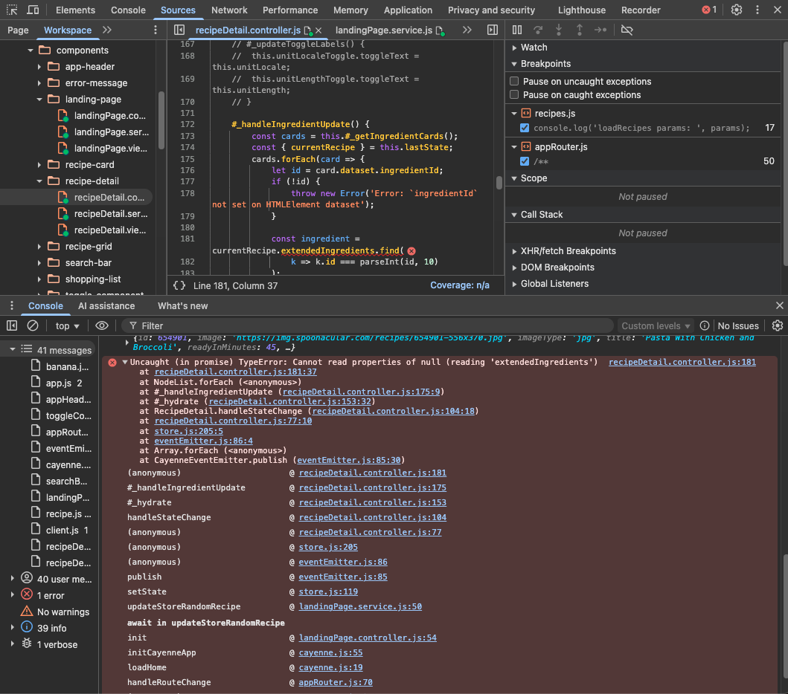

**Issue:**
After navigating away from the recipe detail view (e.g., to home), a subsequent **state update** (triggered by fetching a new random recipe) caused the _previous_ `RecipeDetail` component to react and throw:

```
Uncaught (in promise) TypeError: Cannot read properties of null (reading 'extendedIngredients')
at recipeDetail.controller.js:181
```

**Trigger:**

- The `#_handleIngredientUpdate` method (called per state change) was still subscribed, even though the detail component was no longer on screen.
- Navigation did not properly call `.destroy()` on the prior instance.

**Root Cause:**

- The SPA router/domain logic **did not destroy the previous component instance** upon route change.
- As a result, store/event subscriptions remained live, and methods were triggered on a component that was “orphaned” from the DOM/context.

**Diagnosis:**

- Stack trace points to a store subscription handler.
- Error only occurs _after_ navigating away and then changing state (fetching new random recipe).
- Demonstrates the classic "zombie component" anti-pattern: component logic outlives its intended lifecycle.

**Screenshot Evidence:**

- 
- 
  _(See attached for original stack trace and error site in VSCode/Chrome DevTools)_

**Resolution:**

- Refactored router so that all route handlers return their component instance (or `null`).
- The router stores the instance reference per route in `AppRouter.currentInstances`.
- Before rendering a new view, the router calls `.destroy()` on the previous instance (if any), ensuring all subscriptions are cleaned up.
- Pattern adopted:
  - All main components implement a `.destroy()` method for cleanup.
  - Handlers always return the component or `null`, for uniform teardown.

**Follow-Up:**

- Will next **refine state subscriptions** in `RecipeDetail` to react only to relevant state (e.g., `currentRecipe`), avoiding over-reaction to unrelated changes.
